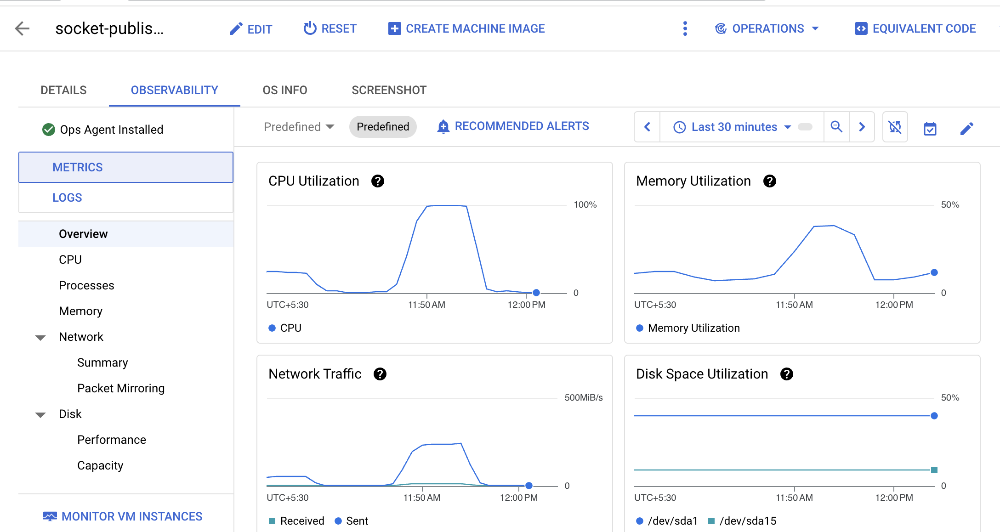

# Run the test
    artillery run web-socket-test.yaml --record --key a9_UpdTTQsqeDnW5BcN9msBox8jaYFoDpQZ

# Installation
sudo apt update
sudo apt install nodejs
node -v
sudo apt install npm
npm install -g artillery@latest

Golang Result
    Run URL: https://app.artillery.io/load-tests/t8p9t_p9zwq34pwpjg35yj89tmgbftzac7k_7e4a

NodeJS

https://app.artillery.io/cILgEHCDZV4LXL8YGTGxWw5D/load-tests/twz57_za4p7dtm366ahegw3hew9yqee88m9_nny5/metrics

Testing with the 16c Client machine

Golang Server
11.45 IST
20K Clients 
100 clients per second

11.46 IST 
Refreshed golang server
https://app.artillery.io/load-tests/td4ej_ex9pqy9wz36kcf3qdjwfwk8fq6ew4_3wmw

12.01 
NodeJS Server

https://app.artillery.io/share/sh_afe283d9229aea25353f71b247dcf23ea3f882eb167b8127ff5c9dbb8102ee8d

